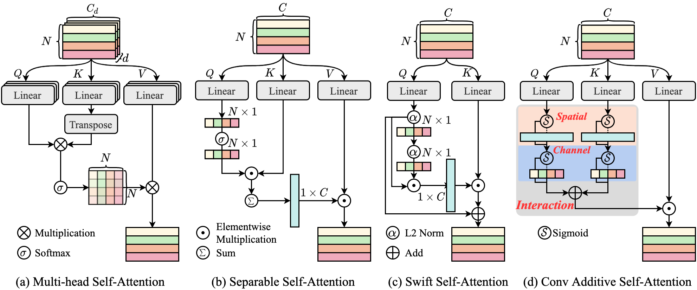
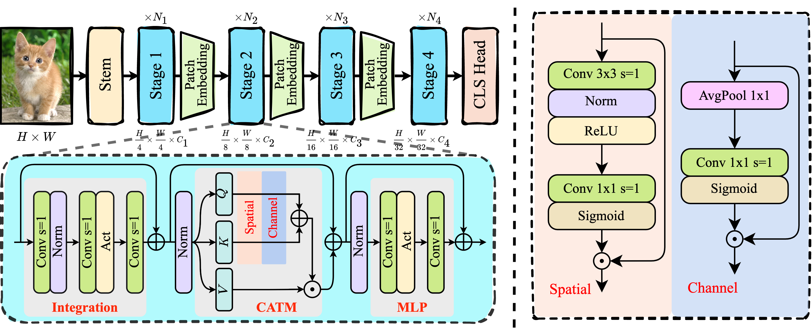

# CAS-ViT: Convolutional Additive Self-attention Vision Transformers for Efficient Mobile Applications

[](https://arxiv.org/abs/2408.03703) [](https://github.com/Tianfang-Zhang/CAS-ViT)

📌 Official Implementation of our proposed method CAS-ViT.

---
<p align="center">
  
</p>

Comparison of diverse self-attention mechanisms. (a) is the classical multi-head self-attention in ViT. (b) is the separable self-attention in MobileViTv2, which reduces the feature metric of a matrix to a vector. (c) is the swift self-attention in SwiftFormer, which achieves efficient feature association only with **Q** and **K**. (d) is proposed convolutional additive self-attention.

<p align="center">
  
</p>

**Upper:** Illustration of the classification backbone network. Four stages downsample the original image to 1/4, 1/8, 1/16, 1/32 . **Lower:** Block architecture with N$_i$ blocks stacked in each stage.

## Model Zoo

You can download the pretrained weights and configs from [Model Zoo](./MODEL_ZOO.md).

## Requirements

```bash
torch==1.8.0
torchvision==0.9.1
timm==0.5.4
mmcv-full==1.5.3
mmdet==2.24
mmsegmentation==0.24
```

## Classification


### 1. Data Prepare

Download ImageNet-1K dataset.
```
│imagenet/
├──train/
│  ├── n01440764
│  │   ├── n01440764_10026.JPEG
│  │   ├── n01440764_10027.JPEG
│  │   ├── ......
│  ├── ......
├──val/
│  ├── ILSVRC2012_val_00000293.JPEG
│  ├── ILSVRC2012_val_00002138.JPEG
│  ├── ......
```

Load image from `./classification/data/imagenet1k/train.txt`.

### 2. Evaluation

Download the pretrained weights from [Model Zoo](./MODEL_ZOO.md) and run the following command for evaluation on ImageNet-1K dataset.

```shell
MODEL=rcvit_m # model to evaluate: rcvit_{xs, s, m, t}
python main.py --model ${MODEL} --eval True --resume <path to checkpoint> --input_size 384 --data_path <path to imagenet>
```

Checkpoint of CAS-ViT-M should give:
```
* Acc@1 81.430 Acc@5 95.664 loss 0.907
```

### 3. Training

On a single machine with 8 GPUs, run the following command to train:
```python
python -m torch.distributed.launch --nproc_per_node 8 main.py \
    --data_path <path to imagenet> \
    --output_dir <output dir> \
    --model rcvit_m \
    --lr 6e-3 --batch_size 128 --drop_path 0.1 \
    --model_ema True --model_ema_eval True \
    --use_amp True --multi_scale_sampler
```

### 4. Finetuning

On a single machine with 8 GPUs, run the following command to funetune:
```python
python -m torch.distributed.launch --nproc_per_node 8 main.py \
    --data_path <path to imagenet> \
    --output_dir <output dir> \
    --finetune <path to model weights> \
    --input_size 384 --epoch 30 --batch_size 64 \
    --lr 5e-5 --min_lr 5e-5 --weight_decay 0.05 \
    --drop_path 0 --model_ema True \
    --model_ema_eval True --use_amp True \
    --auto_resume False --multi_scale_sampler
```
## Object Detection and Instance Segmentation

### 1. Data preparation

Prepare COCO according to the guidelines in [MMDetection](https://github.com/open-mmlab/mmdetection/tree/v2.24.0).

### 2. Evaluation

To evaluate CAS-ViT + RetinaNet on COCO val 2017 on a single machine with 8 GPUs, run the following command:
```python
python -m torch.distributed.launch --nproc_per_node 8 test.py \
    <config path> \
    <checkpoint file> \
    --launcher pytorch
```

### 3. Training

To train CAS-ViT-M + RetinaNet on COCO val 2017 on a single machine with 8 GPUs, run the following command:

```python
python -m torch.distributed.launch --nproc_per_node 8 train.py \
    <config path> --launcher pytorch
```

## Semantic Segmentation

### 1. Data preparation

Prepare ADE20K according to the guidelines in [MMSegmentation](https://github.com/open-mmlab/mmsegmentation/tree/0.x).

### 2. Evaluation

To evaluate CAS-ViT + Semantic FPN on ADE20K on a single machine with 8 GPUs, run the following command:
```python
python -m torch.distributed.launch --nproc_per_node 8 tools/test.py \
    <config path> \
    <checkpoint file> \
    --launcher pytorch
```

### 3. Training

To train CAS-ViT-M + Semantic FPN on ADE20K on a single machine with 8 GPUs, run the following command:

```python
python -m torch.distributed.launch --nproc_per_node 8 tools/train.py \
    <config path> --launcher pytorch
```

## Citation

```bibtex
@article{zhang2024cas,
  title={CAS-ViT: Convolutional Additive Self-attention Vision Transformers for Efficient Mobile Applications},
  author={Zhang, Tianfang and Li, Lei and Zhou, Yang and Liu, Wentao and Qian, Chen and Ji, Xiangyang},
  journal={arXiv preprint arXiv:2408.03703},
  year={2024}
}
```

## Acknowledgment
Our code was build base on [ConvNeXt](https://github.com/facebookresearch/ConvNeXt), [EdgeNeXt](https://github.com/mmaaz60/EdgeNeXt/tree/main), [PoolFormer](https://github.com/sail-sg/poolformer/tree/main), [MMDetection](https://github.com/open-mmlab/mmdetection/tree/v2.24.0) and [MMsegmentation](https://github.com/open-mmlab/mmsegmentation/tree/0.x). Thanks for their public repository and excellent contributions!

